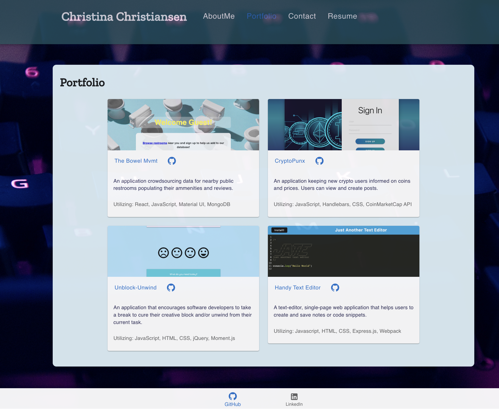
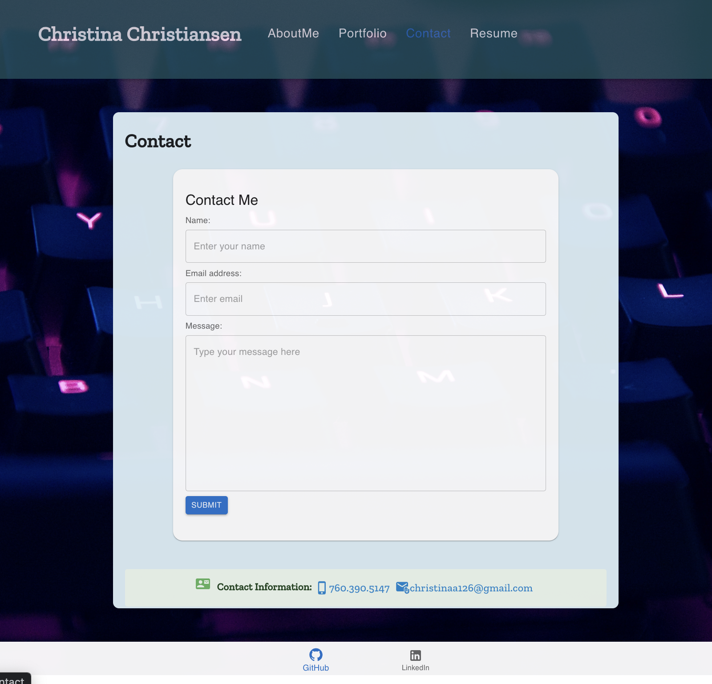
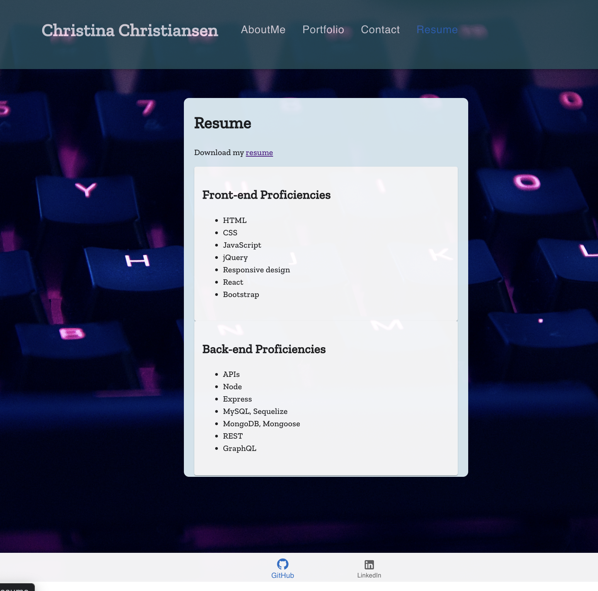

# my-react-portfolio

Portfolio showcasing my projects and contact information

## Link

### Click [here](https://christinaa126.github.io/my-react-portfolio/) to view the deployed link.

## Table of Contents

- [Link](#link)
- [Description](#description)
- [Installation](#installation)
- [Usage](#usage)
- [Technologies](#technologies)
- [Assets](#assets)
- [License](#license)

## Description

This is my online portfolio where you can find out a little bit about me, my projects, resume, and contact information!

Please reach out to me with any questions or concerns.

## Installation

**For users** - no installation required, please visit the deployed [application link](https://christinaa126.github.io/my-react-portfolio/)

**For developers** - use the following commands in root folder

- To install npm packages: `npm i`
- To install [Material UI](https://mui.com/material-ui/getting-started/overview/) (if needed): `npm install @mui/material @emotion/react @emotion/styled`
- To start the app: `npm start` or `npm run start`
- To stop the app: `Control+C` then close your terminal

## Usage

- Upon clicking on the link- you will be redirected to the landing page where you can read a brief summary about me.

- **Navigation Bar**: You can click on the links (`AboutMe`, `Portfolio`, `Contact`, and `Resume`) to view the corresponding pages.
  - `Portfolio`: Click on the title of the projects to be redirected to that deployed application.
    - Clicking on the GitHub icon next to the project title will redirect user to the project's GitHub Repo.
  - `Contact`:
    - Use the **Contact Me** form to send me a message.
    - View my contact information underneath the **Contact Me** form.
  - `Resume`: You can view my front-end and back-end proficiencies as well as click the `resume` link that will redirect user to a downloadable PDF of my resume
- **Bottom Navigation**
  - Click on the `GitHub` icon to visit my GitHub profile page
  - Click on the `LinkedIn` icon to visit my LinkedIn profile page

## Technologies

```md
- HTML
- CSS
- JavaScript
- Material UI
- EmailJS
- React / Create React App
```

## Assets

The following images demonstrate the web application's appearance and functionality:

**About Me**


**Portfolio**


**Contact**


**Resume**

